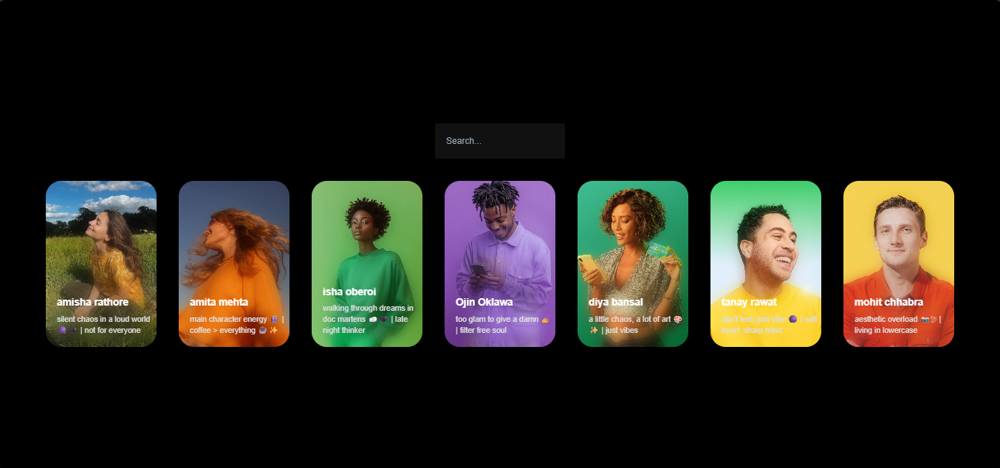

# 🚀 Dynamic User Cards

A responsive JavaScript project that dynamically generates user profile cards with a **real-time search and filtering system** using DOM manipulation.

## 🌐 Live Demo

👉 **[View Live Demo](https://brajesh1210.github.io/Dynamic-User-Cards/)**

## 📸 Preview



## ✨ Features

- 🎴 Dynamically generated user profile cards
- 🔍 Real-time user search
- ⚡ Instant filtering without page reload
- 🖼️ Dynamic profile images
- 🌫️ Blurred background effect
- 📱 Responsive UI
- 🎨 Clean and modern design

## 🛠️ Built With

- **HTML5**
- **CSS3**
- **JavaScript (ES6)**
- **DOM Manipulation**

## 🧠 JavaScript Concepts Used

- Arrays & Objects
- `forEach()`
- `filter()`
- `includes()`
- Arrow Functions
- Template Literals
- `document.createElement()`
- `appendChild()`
- Event Listeners
- Dynamic DOM Rendering

## ⚙️ How It Works

The user information is stored inside a JavaScript array.

```js
const users = [
    {
        name: "amisha rathore",
        pic: "image-url",
        bio: "silent chaos in a loud world"
    }
];
```

JavaScript then dynamically creates the cards using DOM manipulation.

The search input listens for the `input` event and filters the users in real time.

```js
const filteredUsers = users.filter(({ name }) =>
    name.toLowerCase().includes(searchValue)
);
```

The matching users are then rendered back onto the page.

## 📂 Project Structure

```text
Dynamic-User-Cards/
│
├── assets/
│   └── preview.png
│
├── index.html
├── style.css
├── script.js
└── README.md
```

## 🚀 Run Locally

Clone the repository:

```bash
git clone https://github.com/brajesh1210/Dynamic-User-Cards.git
```

Go into the project directory:

```bash
cd Dynamic-User-Cards
```

Open `index.html` in your browser.

## 📚 What I Learned

This project helped me practice:

- Creating elements dynamically with JavaScript
- Manipulating the DOM
- Working with arrays of objects
- Implementing real-time search
- Filtering data using JavaScript
- Rendering dynamic UI components
- Handling user input events

## 🔮 Future Improvements

- [ ] Search by bio
- [ ] Highlight matching text
- [ ] Alphabetical sorting
- [ ] Dark/Light mode
- [ ] Fetch users from an API
- [ ] Add card animations
- [ ] Add debouncing to search

## 👨‍💻 Author

**Brajesh Upadhyay**

GitHub: [@brajesh1210](https://github.com/brajesh1210)

---

⭐ If you like this project, consider giving it a star!
